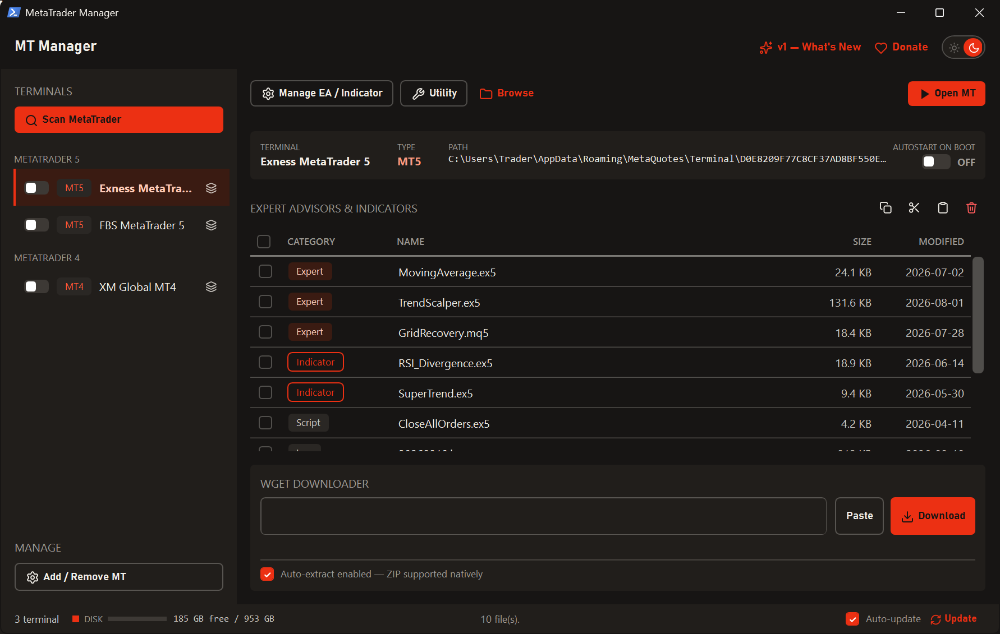
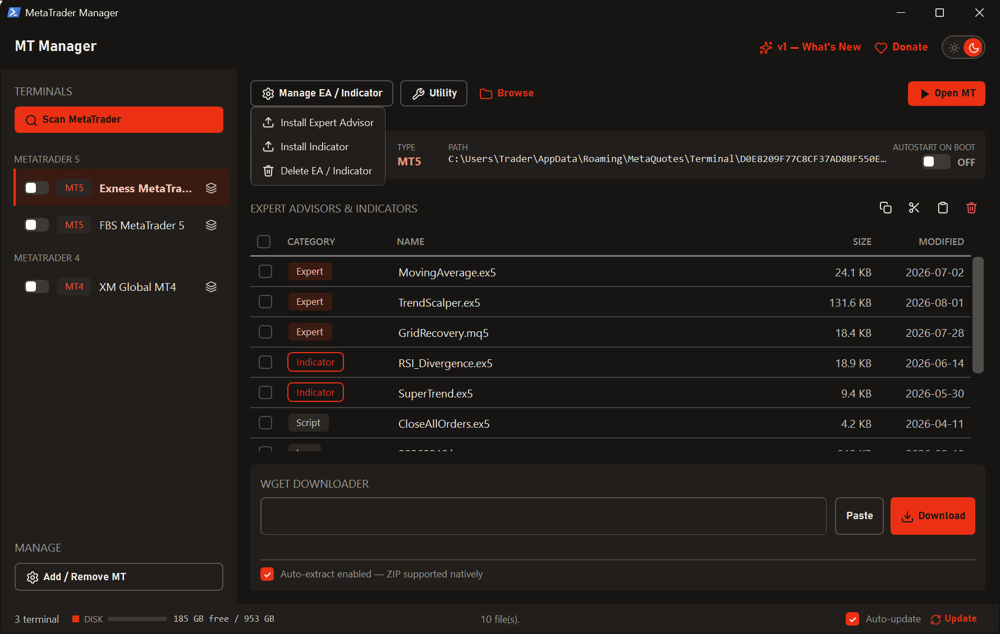
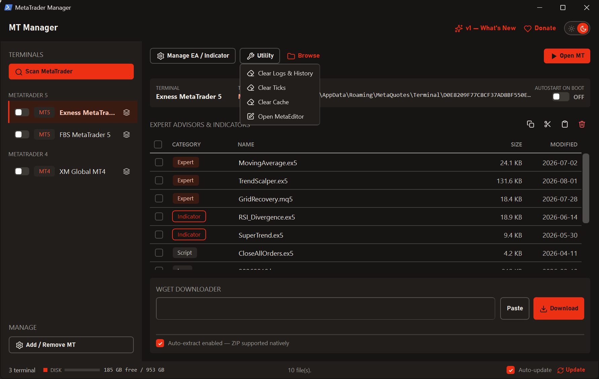
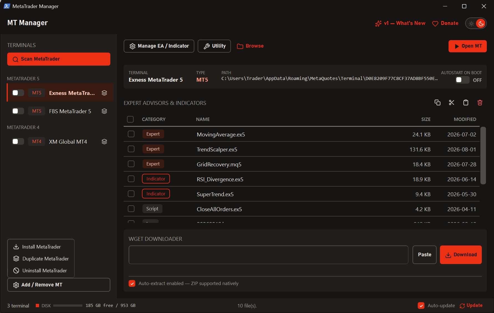
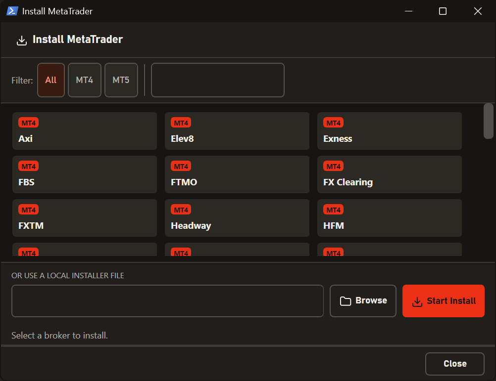
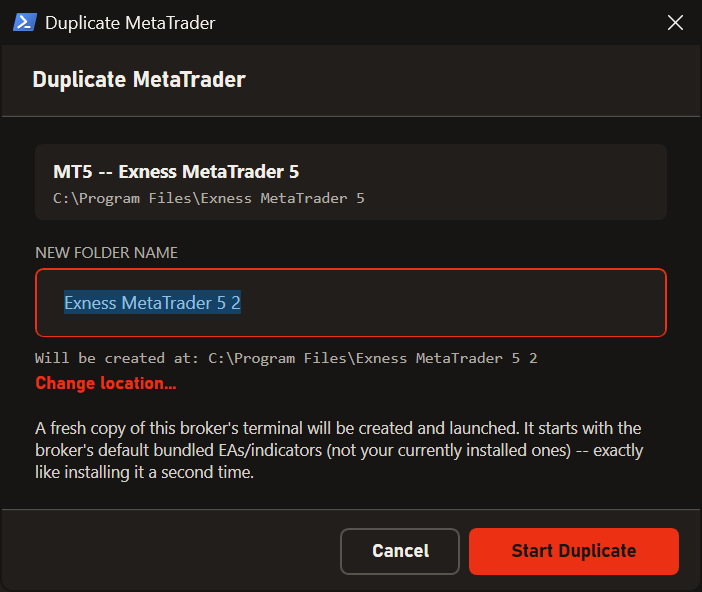
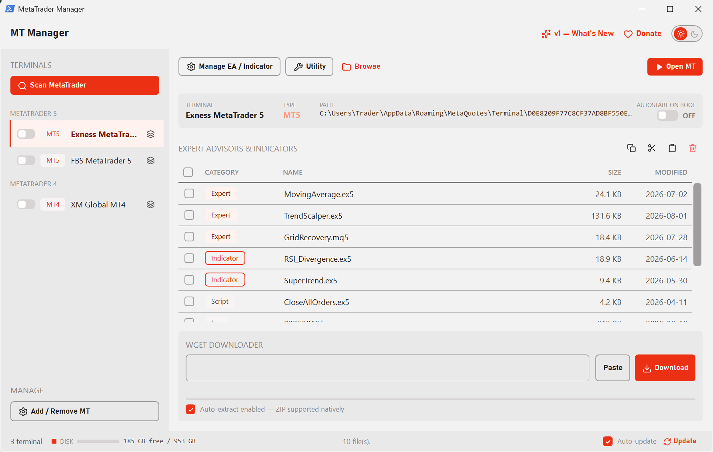
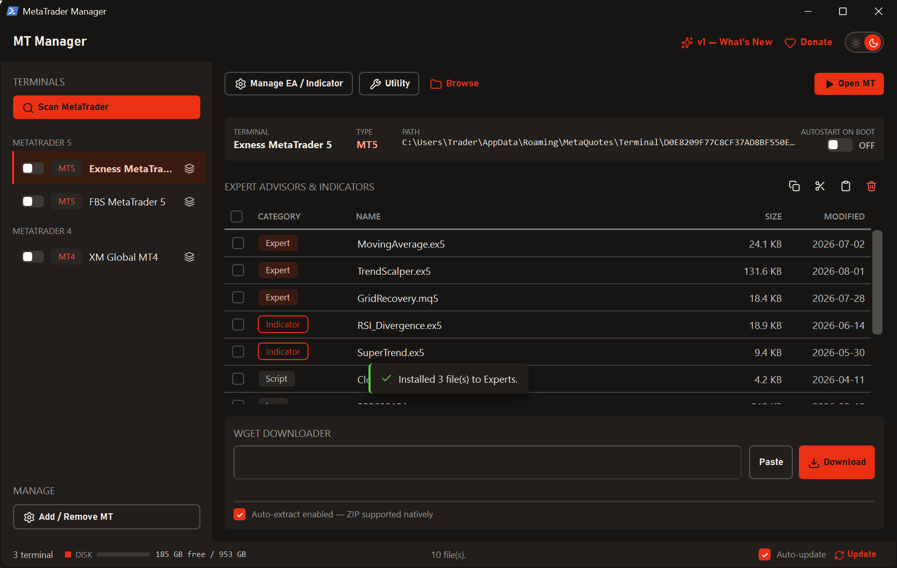
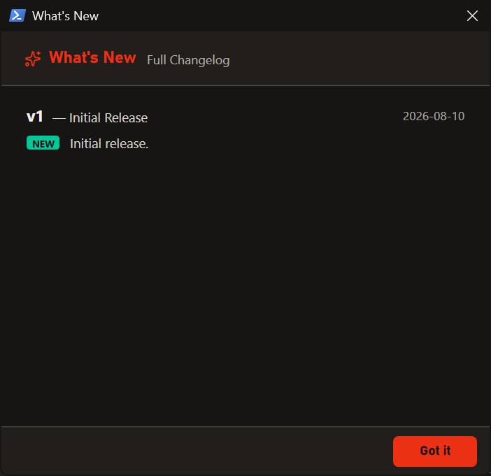
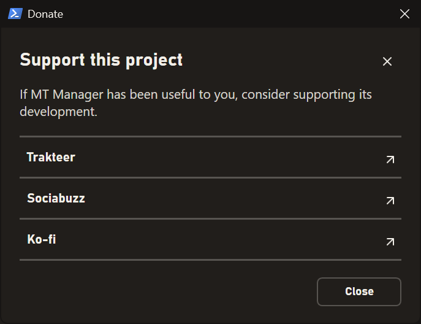

[README.md](https://github.com/user-attachments/files/30887901/README.md)

# MT Manager

**Satu aplikasi untuk mengatur semua terminal MetaTrader Anda.**

Scan otomatis semua MT4 & MT5 yang terpasang, kelola EA dan Indicator,
bersihkan file sampah, duplikat terminal, sampai unduh EA langsung dari link —
semuanya dari satu jendela.

---

## Kenapa MT Manager?

Kalau Anda menjalankan lebih dari satu akun MetaTrader, pekerjaan kecil jadi
melelahkan. Mau pasang satu EA ke lima terminal? Buka folder data satu per satu.
Mau tahu kenapa disk penuh? Telusuri folder `Logs`, `Bases`, `Tester` sendiri.
Mau menambah terminal kedua dari broker yang sama? Install ulang dari awal.

MT Manager mengumpulkan semua itu ke satu tempat. Terminal Anda terdeteksi
otomatis, isinya ditampilkan rapi per kategori, dan setiap tindakan tinggal
satu klik.

---

## ✨ Fitur

### Semua terminal terdeteksi otomatis

Tekan **Scan MetaTrader** dan semua MT4/MT5 yang terpasang langsung muncul di
sidebar, dikelompokkan per jenis. Pilih salah satu untuk melihat detailnya:
nama, tipe, lokasi folder data, dan status autostart.

Isi terminal ditampilkan sebagai satu daftar rapi dengan label warna per
kategori — **Expert Advisor**, **Indicator**, **Script**, **Log**, **History**,
**Ticks**, dan **Cache** — lengkap dengan ukuran dan tanggal ubah.

### Kelola EA & Indicator

Pasang EA atau Indicator ke terminal yang sedang dipilih tanpa perlu tahu di
folder mana file-nya harus ditaruh. Butuh menghapus? Centang beberapa file
sekaligus lalu hapus dalam satu langkah. Tersedia juga **Copy / Cut / Paste**
antar terminal — praktis untuk menyalin EA yang sama ke beberapa akun.

### Bersihkan file sampah

MetaTrader menumpuk log, data history, tick, dan cache tester yang bisa memakan
puluhan gigabyte. Menu **Utility** membersihkannya per jenis, jadi Anda bisa
memilih mana yang dibuang tanpa menyentuh EA atau setting. MetaEditor juga bisa
dibuka langsung dari sini.

### Install, duplikat, dan uninstall MetaTrader

**Install MetaTrader** menyediakan daftar broker siap pasang yang bisa dicari
dan difilter per MT4/MT5 — tinggal pilih, sisanya berjalan sendiri. Punya file
installer sendiri? Bisa juga dipakai lewat pilihan installer lokal.

**Duplicate MetaTrader** membuat terminal kedua dari broker yang sama, lengkap
dengan progress copy dan langsung dijalankan setelah selesai. Berguna kalau
Anda punya beberapa akun di broker yang sama dan ingin tiap akun punya
terminalnya sendiri.

### Unduh EA langsung dari link

Tempel URL (atau perintah `wget` lengkap) ke kotak **Wget Downloader**, dan
file akan diunduh dengan progress bar. File `.zip` otomatis diekstrak begitu
selesai, jadi EA langsung siap dipakai tanpa mampir ke File Explorer.

### Jalan otomatis saat komputer menyala

Setiap terminal punya sakelar **autostart** sendiri. Nyalakan, dan terminal itu
ikut jalan setiap Windows booting — cocok untuk VPS yang harus selalu online.
Saat MT Manager di-uninstall, semua entri autostart yang pernah dibuat ikut
dibersihkan otomatis.

### Tema gelap & terang

Satu klik untuk berganti tema, dan seluruh aplikasi ikut berubah seketika —
termasuk title bar-nya.

### Notifikasi yang tidak mengganggu

Pemberitahuan muncul sebentar lalu hilang sendiri. Tidak ada lagi kotak dialog
yang harus ditutup manual setiap kali menyelesaikan sesuatu.

### Selalu versi terbaru

MT Manager memeriksa pembaruan sendiri, mengunduh, memasang, dan menjalankan
ulang dirinya — Anda cukup menekan satu tombol. Setiap versi baru datang dengan
catatan perubahan yang bisa dibaca kapan saja lewat **What's New**.

---

## 💻 System Requirements

| | Minimum |
|---|---|
| **Sistem operasi** | Windows 7 SP1 atau lebih baru — Windows 8, 8.1, 10, dan 11 didukung penuh (32-bit maupun 64-bit) |
| **.NET Framework** | Versi 4.8. Sudah bawaan di Windows 10 (update Mei 2019) ke atas; installer akan memberi tahu dan mengarahkan ke halaman unduhan resmi Microsoft bila belum ada |
| **MetaTrader** | MT4 dan/atau MT5 yang terpasang secara normal. Instalasi **portable** tidak terdeteksi |
| **Ruang disk** | Sekitar 10 MB untuk aplikasi |
| **RAM** | Tidak ada kebutuhan khusus — aplikasi ini ringan |
| **Hak Administrator** | **Tidak wajib.** MT Manager terpasang per-pengguna. Administrator hanya diperlukan bila Anda menduplikasi terminal yang berada di dalam `Program Files` |
| **Koneksi internet** | Diperlukan hanya untuk daftar broker, pengecekan pembaruan, dan Wget Downloader. Semua fitur lain berjalan offline |

---

## 📥 Instalasi

1. Unduh `MTManager-Setup-1.exe` dari halaman [Releases](../../releases).
2. Jalankan installer-nya, ikuti langkahnya sampai selesai.
3. Buka MT Manager, tekan **Scan MetaTrader**, dan terminal Anda langsung muncul.

Tidak perlu konfigurasi apa pun setelah instalasi.

---

## ❤️ Dukung Proyek Ini

MT Manager gratis dan bisa dipakai siapa saja. Kalau aplikasi ini membantu
pekerjaan Anda, dukungan sekecil apa pun sangat berarti untuk pengembangannya.

---

## ❓ Pertanyaan Umum

**Apakah MT Manager mengubah setting atau akun trading saya?**
Tidak. MT Manager hanya mengelola file dan folder milik terminal — memasang,
menyalin, dan menghapus EA/Indicator, serta membersihkan log dan cache.
Akun, chart, dan setting trading Anda tidak disentuh.

**Kenapa terminal saya tidak muncul saat di-scan?**
MT Manager membaca terminal yang terpasang secara normal. MetaTrader yang
dijalankan dalam mode **portable** menyimpan datanya di folder aplikasi sendiri
sehingga tidak terdeteksi.

**Apakah data MetaTrader saya ikut terhapus kalau MT Manager di-uninstall?**
Tidak. Yang dibersihkan hanya milik MT Manager sendiri — pengaturan aplikasi
dan entri autostart yang pernah dibuatnya. Folder data MetaTrader tetap utuh.

**Apakah aplikasi ini berbayar?**
Tidak, gratis sepenuhnya.

---

Developer? Catatan teknis, cara build, dan mekanisme update ada di
<a href="docs/DEVELOPMENT.md">docs/DEVELOPMENT.md</a>.

