

# MT Manager — free MetaTrader manager for Windows

**One app to manage every MetaTrader 4 and MetaTrader 5 terminal you run.**

Automatically finds every MT4 and MT5 installed on your PC, manages your Expert
Advisors and indicators, clears out junk files, duplicates terminals, and keeps
an unattended VPS signed in — all from a single window.

**[📖 Website &amp; full feature tour →](https://dhimasbagus402.github.io/MT-Manager-Windows/)**

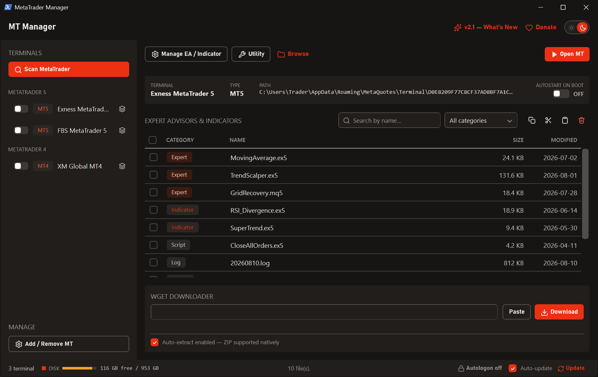

---

## Why MT Manager?

If you run more than one MetaTrader account, the small jobs become the tiring
ones. Want to install a single EA across five terminals? Open each data folder
one by one. Wondering why your disk is full? Go dig through `Logs`, `Bases` and
`Tester` yourself. Need a second terminal from the same broker? Reinstall it
from scratch.

MT Manager brings all of it into one place. Your terminals are detected for you,
their contents are laid out by category, and every action is a single click away.

---

## ✨ Features

### Every terminal, found automatically

Hit **Scan MetaTrader** and every installed MT4/MT5 shows up in the sidebar,
grouped by type. Select one to see its details: name, platform, data folder
location, and whether it starts with Windows.

Its contents appear as one clean list with a colour-coded label per category —
**Expert Advisor**, **Indicator**, **Script**, **Log**, **History**, **Ticks**
and **Cache** — along with each file's size and last-modified date.

### Find a file in a list of thousands

Type part of a name into the **search box** and the table narrows as you type;
pick a **category** to see only Expert Advisors, only indicators, or only the
logs. The count at the bottom tells you what you're looking at — *3 of 10
file(s)* — and anything hidden by a filter is left out of Copy, Cut and Delete,
so you can never act on a row you can't see.

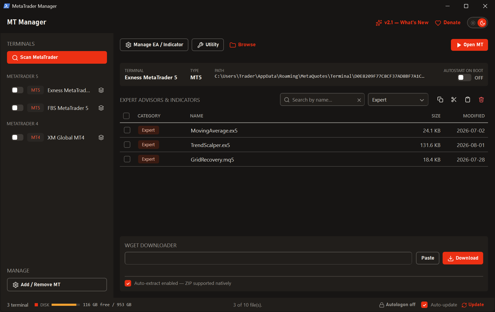

### Keep a VPS signed in with autologon

Setting a terminal to start on boot only gets you half way: Windows runs those
entries *after* somebody signs in, so an unattended machine sits at the sign-in
screen and nothing trades.

**Autologon** closes that gap — set it once and Windows signs itself in after
every restart. The status bar shows whether it's on, and because MT Manager
records how old the account's password was when you set it up, it warns you that
**the saved password needs updating** after you change your Windows password,
before the next reboot catches you out.

The password is stored as an encrypted LSA secret (the same mechanism
Sysinternals Autologon uses), never as plain text in the registry. See the
[privacy policy](PRIVACY.md#windows-autologon) for exactly what is and isn't kept.

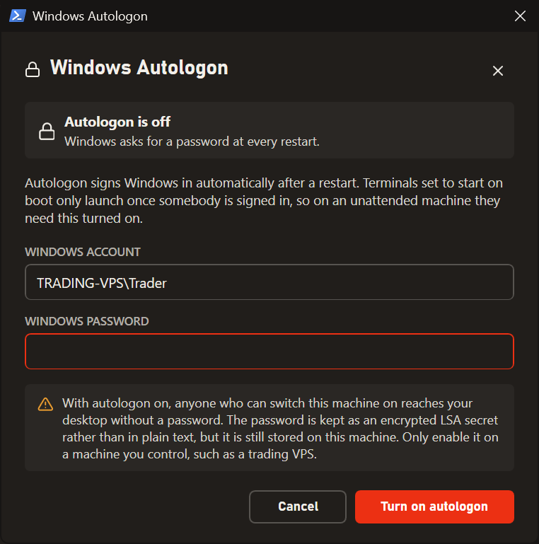

### Manage EAs and indicators

Install an EA or indicator into the selected terminal without ever needing to
know which folder it belongs in. Need to remove some? Tick several files and
delete them in one go. **Copy / Cut / Paste** works across terminals too, which
makes putting the same EA on several accounts quick.

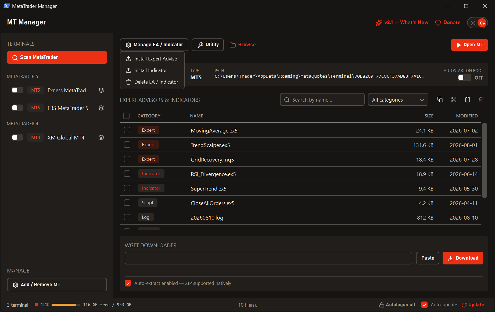

### Clear out the junk

MetaTrader quietly piles up logs, price history, tick data and tester caches
that can swallow tens of gigabytes. The **Utility** menu clears them by type, so
you choose exactly what goes without touching your EAs or settings. MetaEditor
opens straight from here as well.

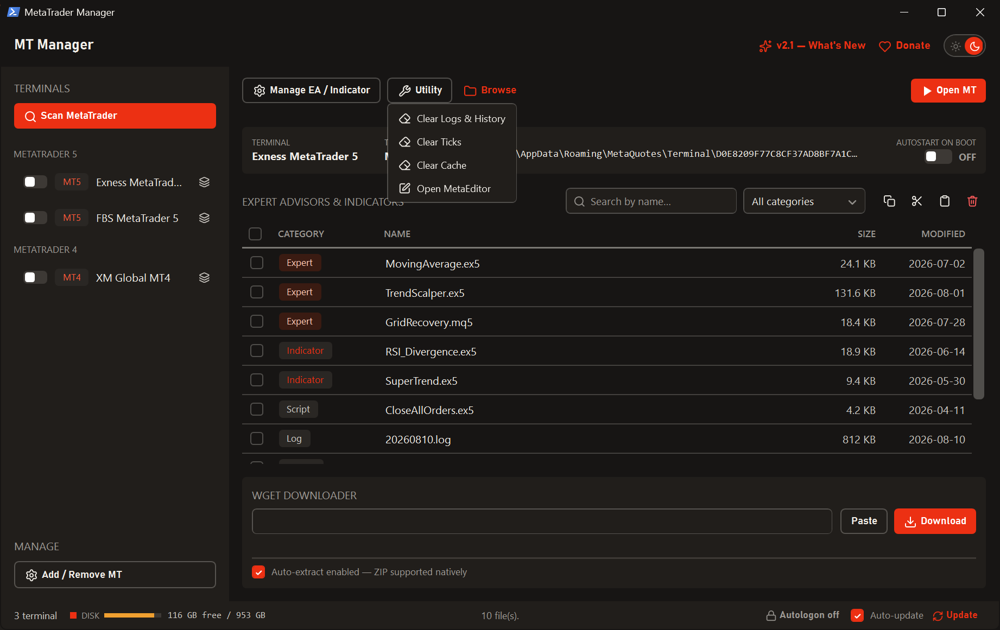

### Install, duplicate and uninstall MetaTrader

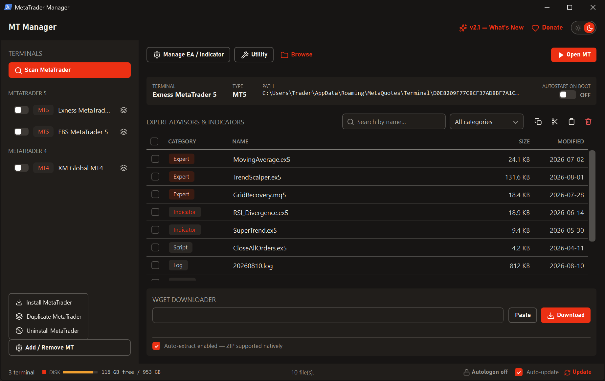

**Install MetaTrader** gives you a searchable, ready-to-install broker list you
can filter by MT4 or MT5 — pick one and the rest happens on its own. Already have
an installer file of your own? Point it at that instead.

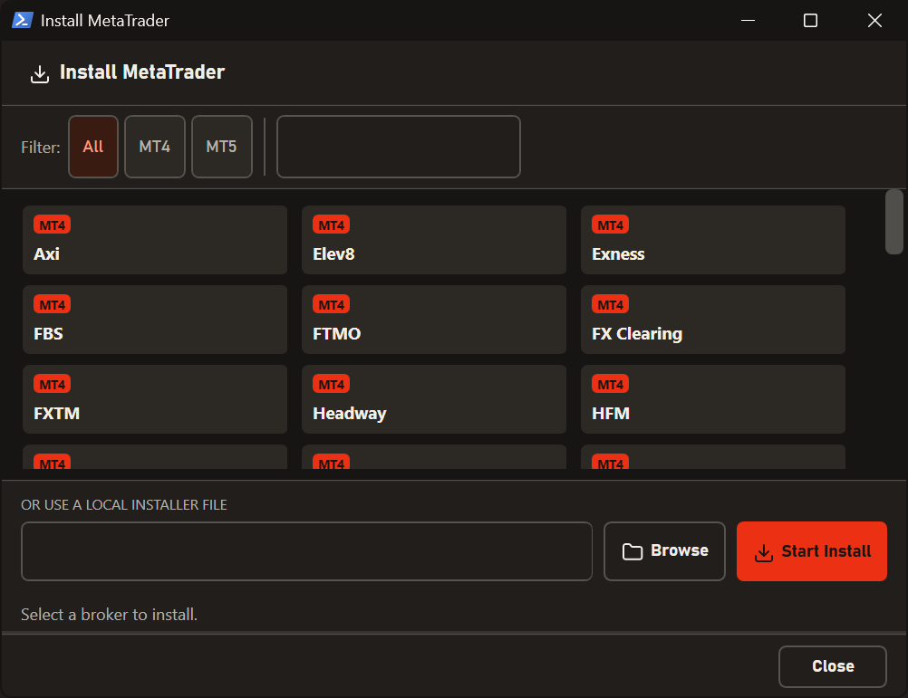

**Duplicate MetaTrader** creates a second terminal from the same broker, with a
copy progress bar, and launches it once it's done. Handy when you hold several
accounts at one broker and want each to have its own terminal.

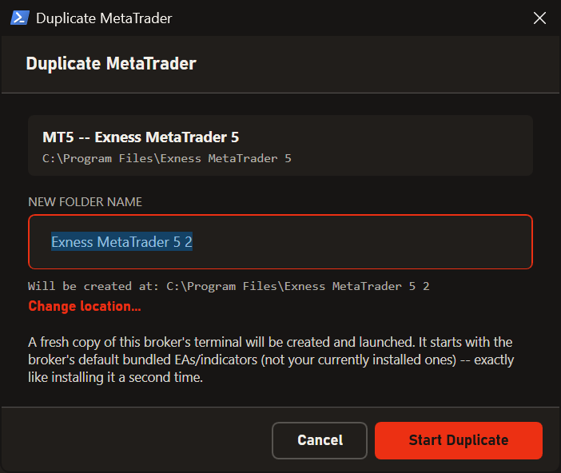

### Download EAs straight from a link

Paste a URL (or a full `wget` command) into the **Wget Downloader** box and the
file downloads with a progress bar. `.zip` files are extracted automatically the
moment they finish, so an EA is ready to use without a detour through File
Explorer.

### Start automatically with your PC

Every terminal gets its own **autostart** switch. Turn it on and that terminal
launches whenever Windows boots — ideal for a VPS that has to stay online.
Switch one on while autologon is off and MT Manager offers to set that up too,
so the pair actually works. If you ever uninstall MT Manager, every autostart
entry it created is removed for you.

### Dark and light themes

One click switches the theme, and the whole app follows instantly — title bar
included.

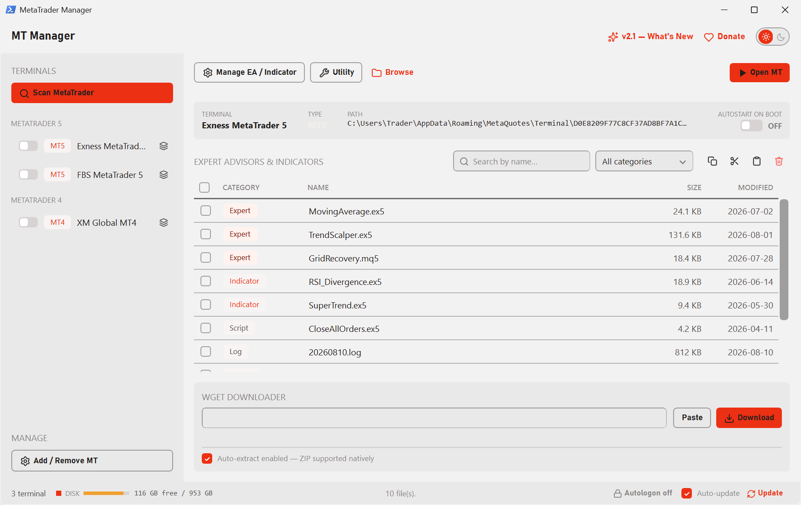

### Notifications that stay out of the way

Messages appear briefly and fade on their own. No more dialog boxes to dismiss
every time something finishes.

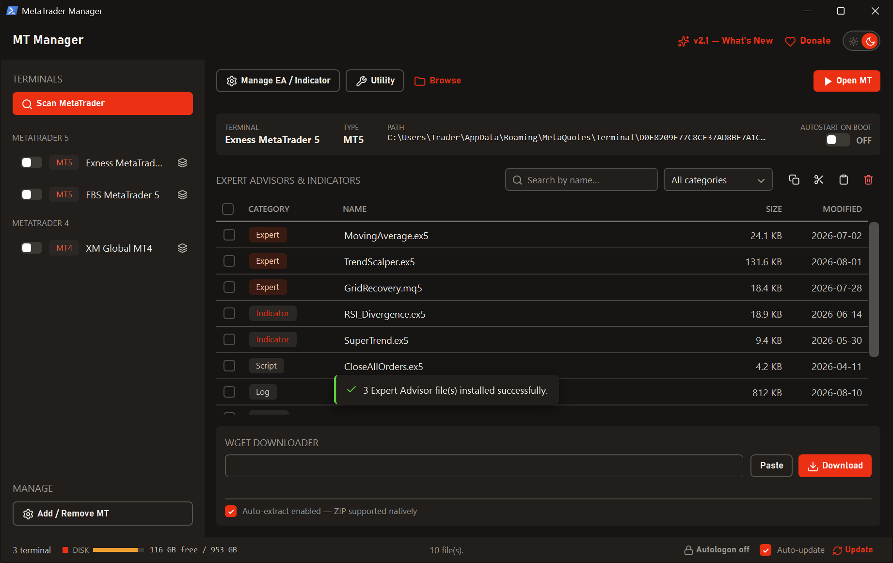

### Always up to date

MT Manager checks for updates, downloads, installs and restarts itself — you
just press one button. Every release comes with notes you can read any time from
**What's New**.

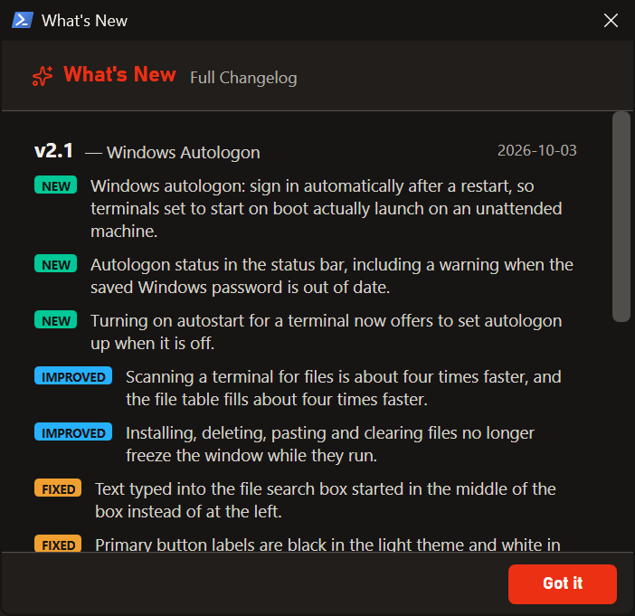

---

## 💻 System Requirements

| | Minimum |
|---|---|
| **Operating system** | Windows 7 SP1 or newer — Windows 8, 8.1, 10 and 11 fully supported (32-bit and 64-bit) |
| **.NET Framework** | Version 4.8. Already included in Windows 10 (May 2019 update) and later; the installer will tell you and point you to Microsoft's official download if it's missing |
| **MetaTrader** | MT4 and/or MT5 installed normally. **Portable** installations are not detected |
| **Disk space** | About 10 MB for the app |
| **RAM** | Nothing special — this is a lightweight app |
| **Administrator rights** | **Not required.** MT Manager installs per user. Administrator is only needed if you duplicate a terminal that lives inside `Program Files` |
| **Internet connection** | Only needed for the broker list, update checks and the Wget Downloader. Everything else works offline |

---

## 📥 Installation

1. Download [`MTManager-Setup-2.1.exe`](https://github.com/dhimasbagus402/MT-Manager-Windows/raw/refs/heads/main/Release/MTManager-Setup-2.1.exe) from the [Releases](https://github.com/dhimasbagus402/MT-Manager-Windows/tree/main/Release) folder.
2. Run the installer and follow it through. No administrator rights needed.
3. Open MT Manager, press **Scan MetaTrader**, and your terminals appear.

There's nothing to configure afterwards. After that, MT Manager updates itself.

---

## 🆕 What's new in 2.1

*Released 3 October 2026.*

- **Windows autologon** — sign in automatically after a restart, so terminals set
  to start on boot actually launch on an unattended machine.
- Autologon status in the status bar, including a warning when the **saved
  Windows password is out of date**.
- Turning on autostart for a terminal now offers to set autologon up when it's off.
- Scanning a terminal for files is about **four times faster**, and the file table
  fills about four times faster.
- Installing, deleting, pasting and clearing files no longer freeze the window
  while they run.
- *Fixed:* text typed into the file search box started in the middle of the box
  instead of at the left.
- *Fixed:* primary button labels are black in the light theme and white in the dark.

Earlier releases are listed in the app under **What's New**.

---

## ❤️ Support This Project

MT Manager is free for anyone to use. If it saves you time, any support at all
goes a long way toward keeping it developed.

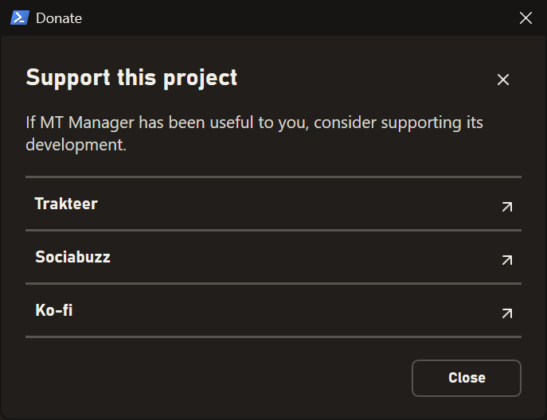

---

## ❓ FAQ

**Does MT Manager change my trading settings or accounts?**
No. It only manages files and folders that belong to your terminals — installing,
copying and deleting EAs and indicators, and clearing logs and caches. Your
accounts, charts and trading settings are never touched.

**Why doesn't my terminal show up when I scan?**
MT Manager reads terminals that were installed normally. MetaTrader running in
**portable** mode keeps its data inside its own program folder, so it isn't
detected.

**Will my MetaTrader data be deleted if I uninstall MT Manager?**
No. Only MT Manager's own things are removed — its settings and any autostart
entries it created. Your MetaTrader data folders are left untouched.

**How do I keep MetaTrader running on a VPS after a reboot?**
Two things are needed: turn on **autostart** for the terminal so Windows launches
it at sign-in, and turn on **Windows autologon** so the machine signs in by
itself after a restart. Without autologon the VPS stops at the sign-in screen and
the terminal never starts. MT Manager sets up both.

**Where does MT Manager store the autologon password?**
As an encrypted LSA secret — the same place Sysinternals Autologon uses — never
as a plain-text registry value. MT Manager keeps no copy of it; it only records
*when* the account's password was last changed, which is how it can tell you the
stored one has gone stale. Details in the [privacy policy](PRIVACY.md#windows-autologon).

**Is this paid software?**
No, it's completely free.

---

## 🔒 Privacy

No accounts, no analytics, no telemetry, nothing sent anywhere. See
[PRIVACY.md](PRIVACY.md).

---
